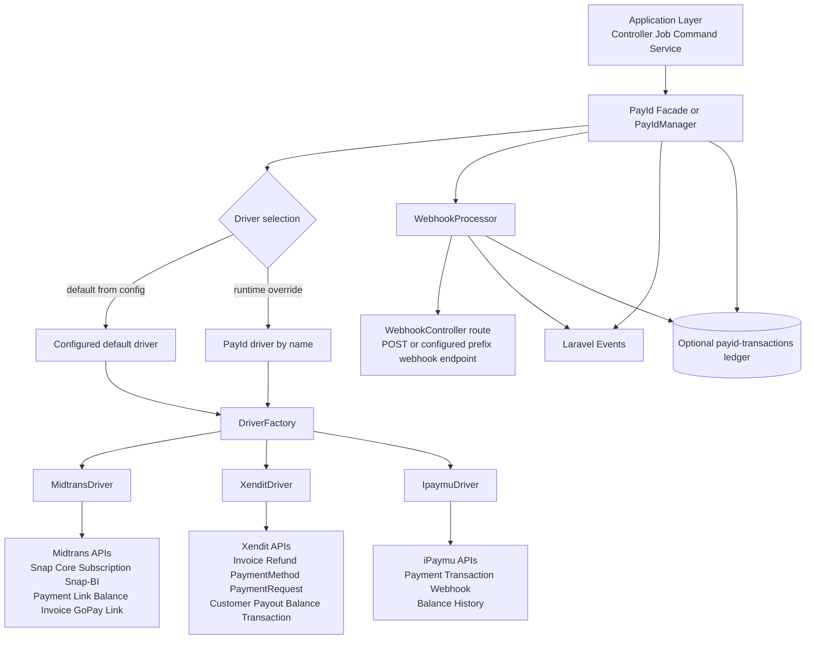
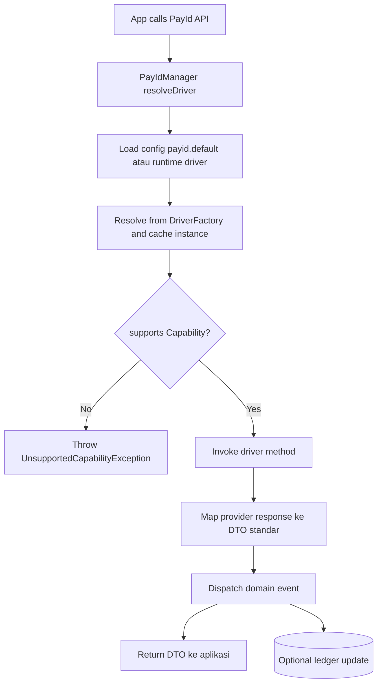
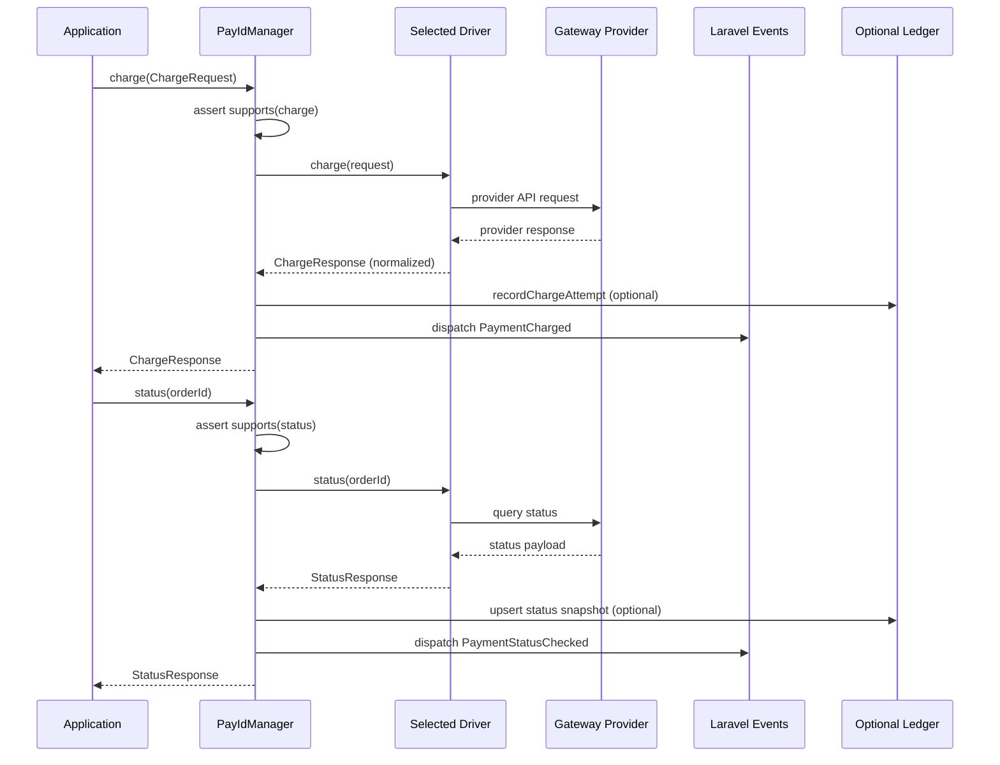
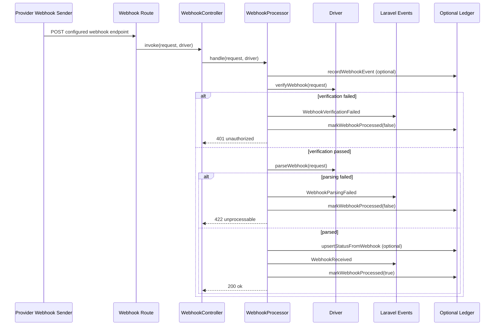
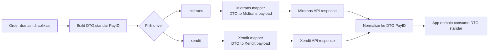
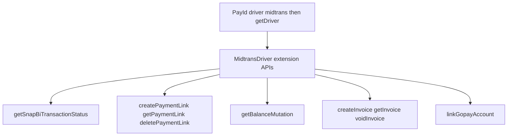
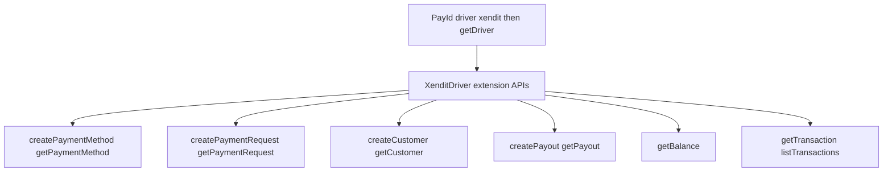
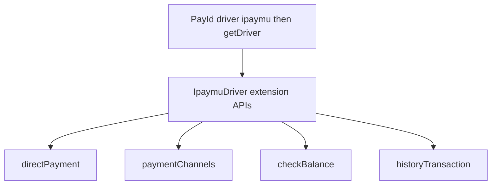

# PayID Complete System Flow Diagram

Dokumen ini merangkum alur end-to-end PayID secara lengkap: operasi manager/facade, routing capability ke driver, webhook pipeline, serta extension flow Midtrans, Xendit, dan iPaymu.

## 1) System context dan boundary

## 2) Flow operasi facade/manager ke driver

## 3) Matrix alur operasi yang bisa dilakukan

| Group | API di PayIdManager (lintas driver) | Capability check | Event core | Ketersediaan Midtrans | Ketersediaan Xendit |
|---|---|---|---|---|---|
| Driver switching | `driver` | N/A | - | Yes | Yes |
| Driver extender | `extend` | N/A | - | Yes | Yes |
| Credential resolver | `resolveCredentialsUsing` | N/A | - | Yes | Yes |
| Payment checkout | `charge` | `charge` | `PaymentCharged` | Yes | Yes |
| Direct charge | `directCharge` | `direct_charge` | `PaymentCharged` | Yes | No |
| Status | `status` | `status` | `PaymentStatusChecked` | Yes | Yes |
| Refund | `refund` | `refund` | `PaymentRefunded` | Yes | Yes |
| Cancel | `cancel` | `cancel` | `PaymentCancelled` | Yes | No |
| Expire | `expire` | `expire` | `PaymentExpired` | Yes | No |
| Approve | `approve` | `approve` | `PaymentApproved` | Yes | No |
| Deny | `deny` | `deny` | `PaymentDenied` | Yes | No |
| Subscription create | `createSubscription` | `create_subscription` | `SubscriptionCreated` | Yes | No |
| Subscription get | `getSubscription` | `get_subscription` | - | Yes | No |
| Subscription update | `updateSubscription` | `update_subscription` | `SubscriptionUpdated` | Yes | No |
| Subscription pause | `pauseSubscription` | `pause_subscription` | `SubscriptionPaused` | Yes | No |
| Subscription resume | `resumeSubscription` | `resume_subscription` | `SubscriptionResumed` | Yes | No |
| Subscription cancel | `cancelSubscription` | `cancel_subscription` | `SubscriptionCancelled` | Yes | No |
| Utility | `supports`, `getDriver` | N/A | - | Yes | Yes |

## 4) Sequence flow operasi pembayaran utama

## 5) Sequence flow webhook pipeline

## 6) Integrasi antar driver (pola interoperability)

Interpretasi:
- Kontrak DTO + enum di core membuat aplikasi tidak perlu tahu bentuk payload proprietary provider.
- Integrasi multi-driver aman selama aplikasi memakai API manager/facade untuk flow generik.
- Untuk fitur provider-specific, aplikasi mengambil driver asli lewat `getDriver()` dan memanggil extension method.

## 7) Driver-specific extension flow yang sudah tersedia

### Midtrans extension (driver-specific)

### Xendit extension (driver-specific)

### iPaymu extension (driver-specific)

## 8) Checklist coverage agar tidak ada yang terlewat

| Area | Sudah tercakup di diagram ini | Catatan |
|---|---|---|
| Driver resolution + default/runtime switch | Yes | include factory + cache instance |
| Capability guard + exception path | Yes | include unsupported capability path |
| Payment operations manager | Yes | charge sampai deny |
| Subscription operations manager | Yes | create sampai cancel |
| Event dispatch core | Yes | payment + subscription + webhook events |
| Optional ledger integration | Yes | manager + webhook processor |
| Webhook endpoint dan middleware flow | Yes | route/controller/processor/response code |
| Webhook error branches | Yes | 401 verification failed, 422 parsing failed |
| Midtrans driver-specific extensions | Yes | Snap-BI, Payment Link, Balance, Invoicing, GoPay link |
| Xendit driver-specific extensions | Yes | PaymentMethod, PaymentRequest, Customer, Payout, Balance, Transaction |
| iPaymu driver-specific extensions | Yes | directPayment, paymentChannels, checkBalance, historyTransaction |
| Interoperability antar driver | Yes | DTO standardization + normalization |

## 9) Rekomendasi penggunaan

- Gunakan API manager/facade untuk seluruh use case generik lintas driver.
- Gunakan `supports(...)` sebelum memanggil capability opsional agar aman saat runtime switch.
- Gunakan extension method hanya untuk kebutuhan provider-specific dan encapsulate di service aplikasi agar boundary tetap bersih.
