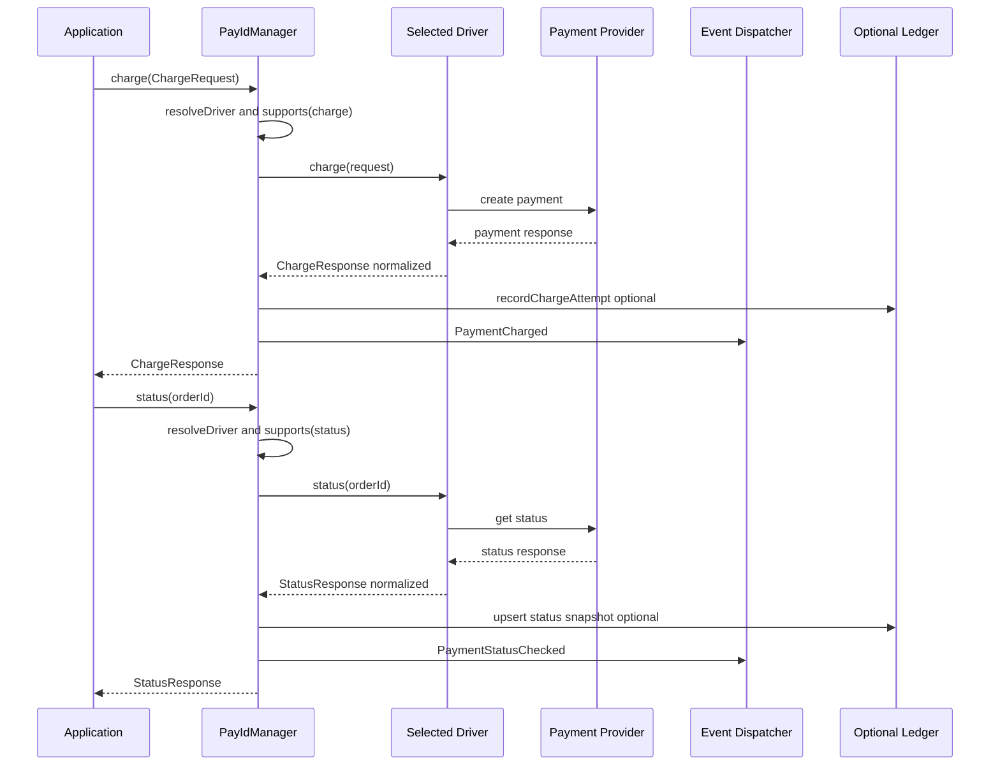
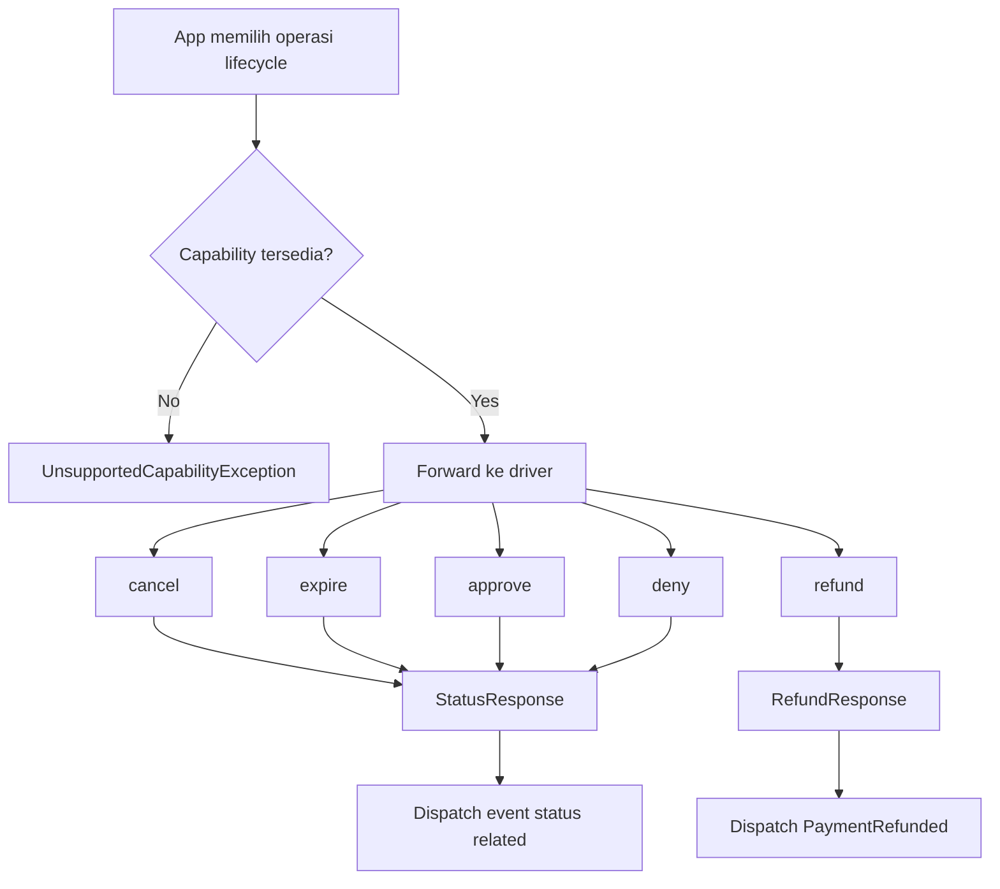

# Checkout and Payment Lifecycle Flow

Diagram ini fokus pada alur payment generik lintas driver melalui API manager/facade PayID.

Catatan:
- Midtrans mendukung seluruh lifecycle di atas.
- Xendit saat ini mendukung flow generik: charge, status, refund.
- iPaymu saat ini mendukung flow generik: charge, status (refund/cancel/expire belum di-expose).
