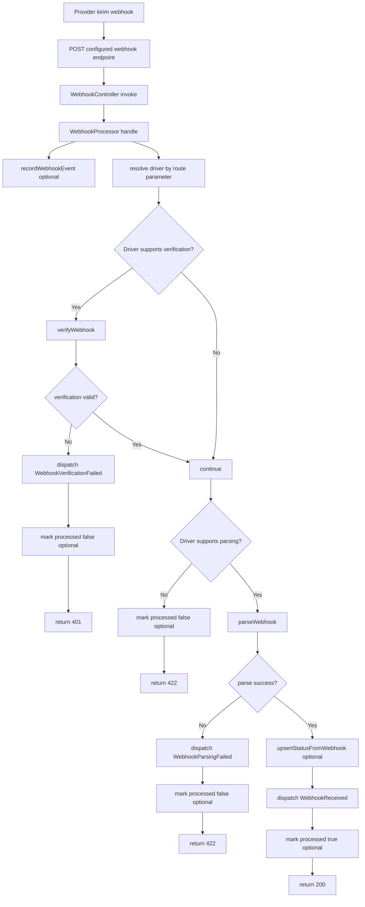

# Webhook Processing Flow

Diagram ini fokus pada inbound webhook route sampai event dispatch di PayID.

Event utama:
- WebhookReceived
- WebhookVerificationFailed
- WebhookParsingFailed

Catatan iPaymu:
- Verification bisa diaktifkan strict melalui `IPAYMU_WEBHOOK_VERIFY=true`.
- Jika disabled, verifier iPaymu mengembalikan true agar webhook tetap diproses.
