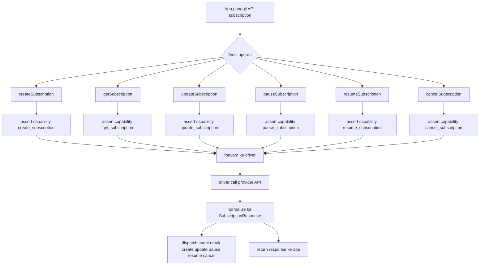

# Subscription Flow

Diagram ini merangkum alur subscription operation pada PayID manager.

Catatan:
- Midtrans: seluruh subscription operation tersedia.
- Xendit: belum expose subscription operation di driver saat ini.
