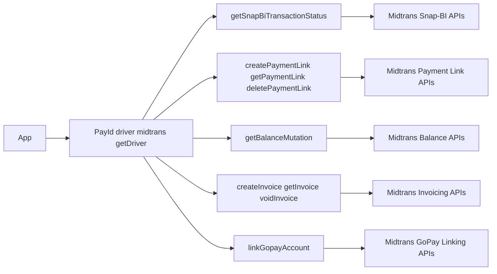
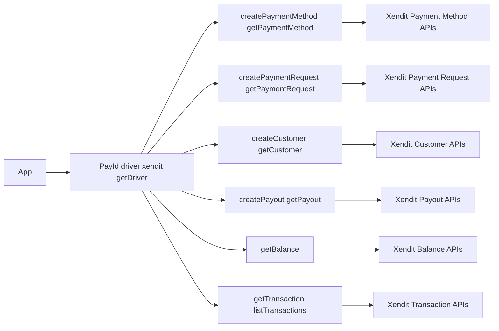
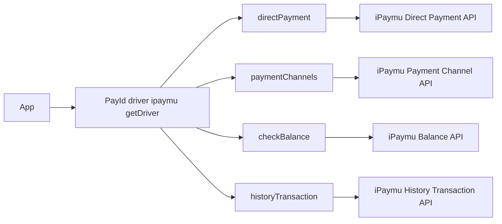

# Driver Extension Flow

Diagram ini menjelaskan operasi provider-specific yang dipanggil lewat driver asli (`getDriver`).

## Midtrans extension flow

## Xendit extension flow

Prinsip:
- Gunakan extension method hanya untuk fitur provider-specific.
- Untuk flow lintas driver, tetap prioritaskan API manager/facade PayID.

## iPaymu extension flow

